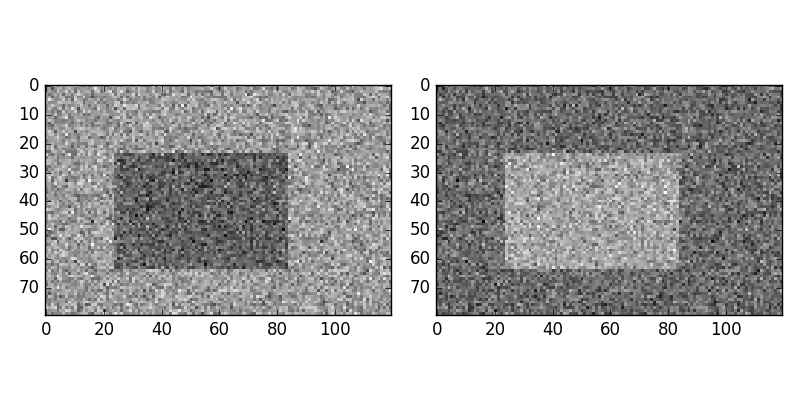
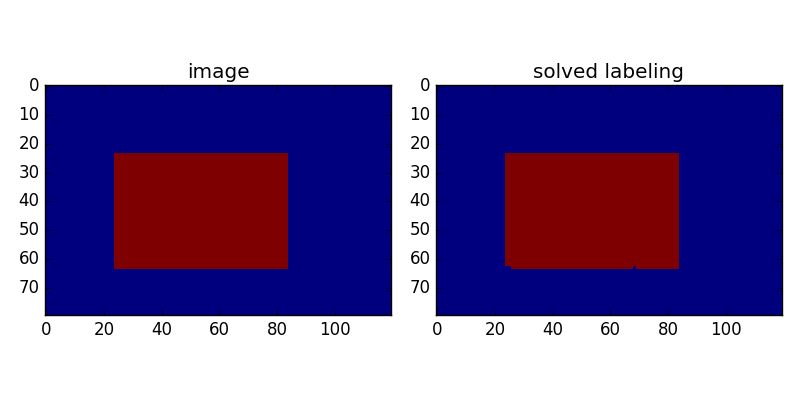
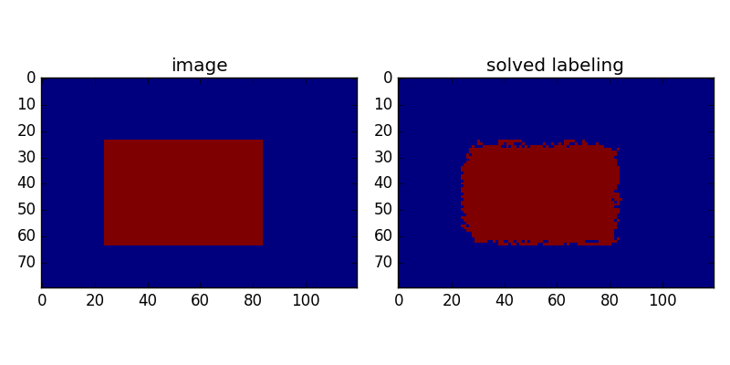

# pyGridCut

[](https://app.codeship.com/projects/197466)
[](https://travis-ci.org/Borda/pyGridCut)
[](https://ci.appveyor.com/project/Borda/pygridcut)

A Python wrapper for the [GridCut C++ library](http://www.gridcut.com/index.php) for solving graph cuts in regular grids.

**Implemented functions:**
 * gridcut.maxflow_2D_4C(...)
 * gridcut.maxflow_2D_4C_potts(...)
 * gridcut.maxflow_2D_8C_potts(...)


## Installation

Actually the latest version is **1.3** as it is set up in the _setup.py_ 

```
python setup.py build_ext --inplace
python setup.py install
```

For installation use previous commands it does following steps:
1. download the source code
1. unzip the package to _code_ folder
1. build the **gridcut**

Note, that downloading the source cede you agree with GridCut [license](http://www.gridcut.com/licensing.php) 

## Show test results

### Source-Sink segmentation

Visualisation of the unary terns for source/sink segmentation



with the initial labeling (left) and estimated labeling (right) for 4-connectivity



and the initial labeling (left) and estimated labeling (right) for 8-connectivity

